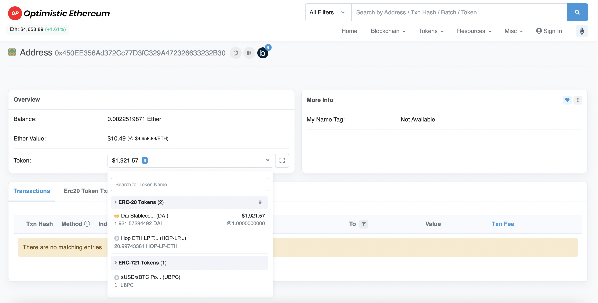

# Transfer failures

Transfers can take up to 15-20mins depending on the route (see [Hop transfer times](https://help.hop.exchange/hc/en-us/articles/4406099772045-How-long-does-a-Hop-transfer-take-)).\
\
If you've waited this long but still think there's something wrong with your transfer it's likely one of these two reasons:\
\
1\) you received hTokens instead of native tokens and need to swap manually\
\
2\) the transfer actually arrived but your wallet doesn't show it\

### 1. Receiving hTokens

In rare circumstances it can happen that the user receives **hTokens** instead of **native tokens** (e.g hUSDC instead of USDC) at the destination. This happens because the final "swap" at the destination times out after a set deadline, meaning the Hop token doesn't get converted in the AMM of the destination chain. \
\
In these instances the user needs to convert their Hop tokens manually in the "Convert" tab to get the native token.

<figure><figcaption></figcaption></figure>

Even more rarely, it can happen that there's no Bonder to "bond" your transfer and front the liquidity on the destination chain. This can can happen either because the Bonder is out of collateral (in which case you have to wait) or because of issues in the Bonder node infrastructure (in which case software needs to be rebooted or patched).\
\
If there is no Bonder liquidity at the destination chain there should be a warning in the Hop UI to let you know of the situation.\
\
If you still somehow send tokens while there is no Bonder liquidity your transaction will be pending until there is **new Bonder liquidity**.

### 2. Tokens don't show up in wallet despite transfer being marked as successful

Often it turns out that these users had received their funds but the transfer was simply not displayed in the transaction list of Metamask or other wallet. This is because, unlike a standard peer-to-peer token transfer, tokens are disbursed by a smart contract and these are not indexed by Metamask. However, your balance is still credited (increased) by the amount of your transfer.\
\
We'll show you two things:\
\
**1) How to find out if the tokens have arrived using a block explorer**\
\
**2) How to manually add a token to the Metamask user interface** \
\
Metamask is just an interface that connects to the Blockchain for you. Sometimes this interface can be buggy and sometimes it doesn't automatically show specific tokens especially on Layer-2 chains.\
\
The best way to find out if your tokens have arrived is by going to a block explorer. The Blockchain is the single source of truth and a block explorer shows you all the data belonging to your account.\
\
For example if you want to see if your funds on have arrived on Optimism you would go to [Optimistic Etherscan](https://optimistic.etherscan.io/).\
\
Paste your wallet address in the big search bar of the home page of the block explorer site and you will see a new page showing data of your account. \
\
In the token dropdown you will see all the tokens that are held in your wallet. **If you see your tokens there you can be assured that everything went well and that it's simply a matter of Metamask not showing your tokens.**

<figure><figcaption></figcaption></figure>

Now that you know the token is there, let's import it manually into Metamask so that the interface shows it too. To do that go into the "Assets" tab and scroll to the bottom where you'll see a "Import tokens" link.

<figure><figcaption></figcaption></figure>

You will then see a form which requires you to paste the address of the token you want to add. You can find the address of a token by typing it's ticker symbol (e.g "USDC) into the block explorer of the chain you are on ( e.g Optimistic Etherscan) or by looking it up on popular directories such as [Coingecko](https://www.coingecko.com/en). \
\
**NOTE: Tokens have different addresses on each chain they exist on ! E.g USDC address on Ethereum is different than USDC on Optimism!**\
\
Once you paste the address the other fields like Token Symbol and Token Decimal will auto-populate.\
\
Click on "Add Custom Token" and you're done. Yo will now see your token in Metamask :-)

<figure><figcaption></figcaption></figure>
