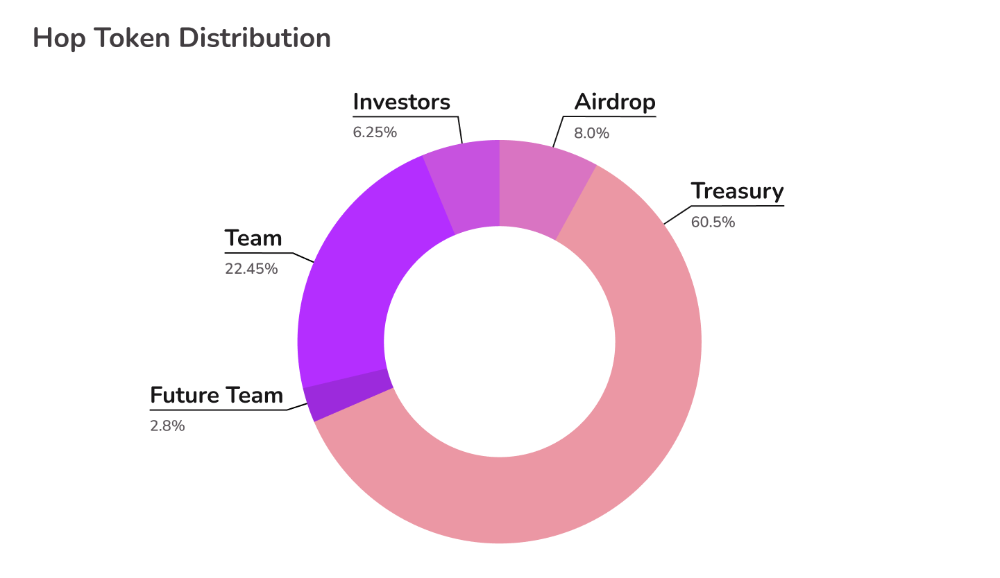

# Token Distribution

There initial supply of Hop tokens at DAO launch was 1,000,000,000 HOP tokens and they were distributed as follows:

* 8% airdropped to early network participants
* 60.5% to the Hop DAO treasury
* 22.45% to the initial development team (3 year vesting, 1 year cliff)
* 2.8% saved for future team members
* 6.25% to investors (3 year vesting, 1 year cliff)

Since then the DAO has allocated Hop tokens from the DAO treasury to a series of initiatives such as a liquidity mining campaign to incentivize liquidity in the bridge AMM's, the formation of a grant committee, a delegate incentivization program and much more.\
\
The % of circulating supply in the hands of community members can be tracked on [Coingecko](https://www.coingecko.com/en/coins/hop-protocol).

<figure><figcaption></figcaption></figure>
